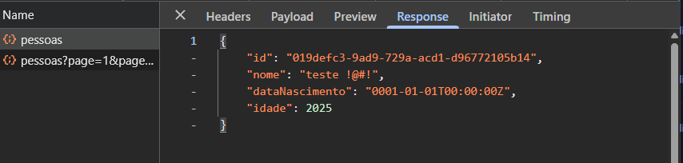
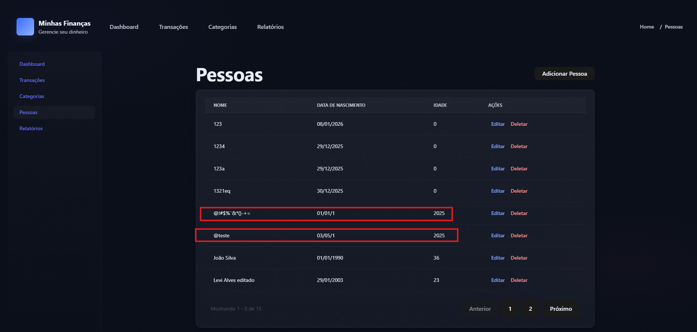
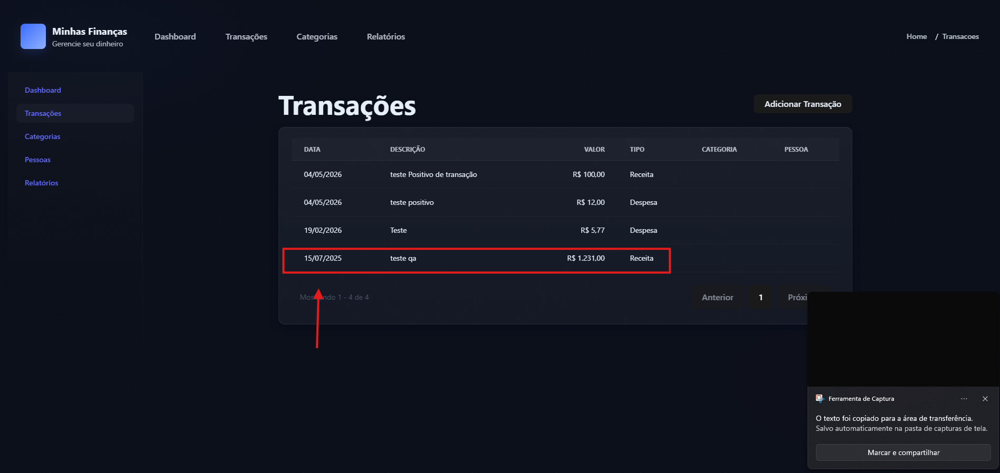
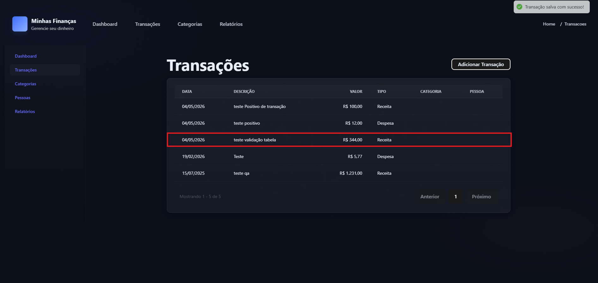
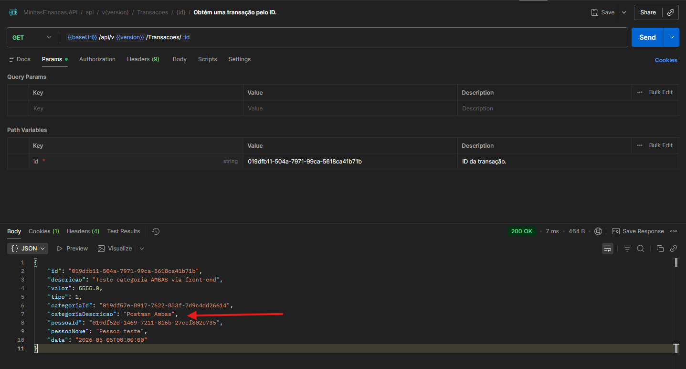
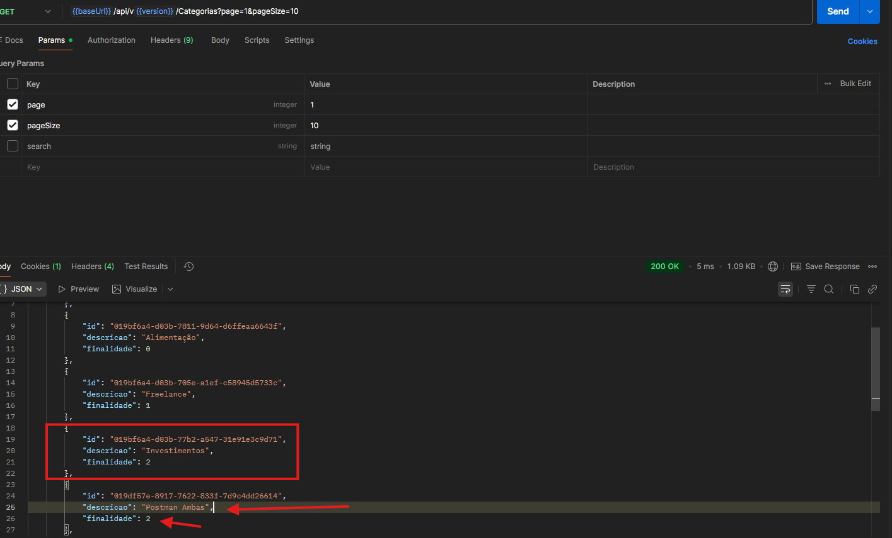
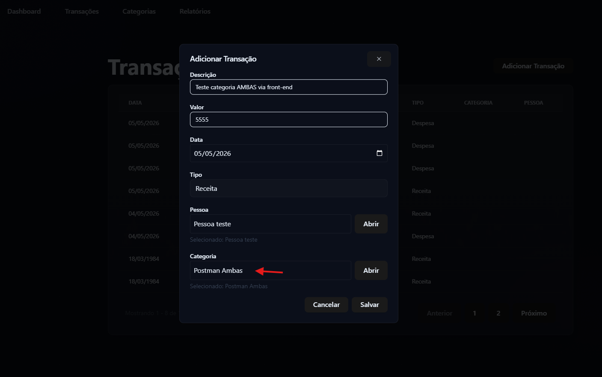

Bugs Minhas Finanças

Responsável: Levi Alves

Objetivo: Este documento tem como objetivo detalhar e explicar todos bugs e inconsistências encontradas na aplicação Minhas Finanças, independente do nível de teste.

Feature: Pessoas

Bug01 – Sistema não tem trava de idade e permite caracteres especiais no nome da pessoa

Como Reproduzir:

- Navegar até “/pessoas”

- Abrir modal de registro de pessoa

- Inserir nome inválido (ex: @teste)

- Inserir data inválida (ex: 01/01/0000)

- Clicar em “Salvar”

Comportamento esperado:

Sistema deve barrar o cadastro quando inserido uma data de nascimento inexistente ou inválida.

Sistema deve permitir apenas uso de letras e acentos provenientes a nomes acentuados como acecntos agudo, circunflexo, til.

Comportamento Atual:

Sistema permite o uso de “@!#$%¨&*()-+=”

Sistema Aceita data como (01/01/0000) e insere como “01/01/01”

Resposta do console:

N/A

Resposta da API:

Evidência de tela:

Bug02 – Sistema permite cadastro de transações com data no passado

Como Reproduzir:

- Navegar até “/transações”

- Clicar em “Adicionar Transação”

- Preencher formulário com dados válidos

- inserir data no passado (ex: 04/05/2025)

- Clicar em “Salvar”

Comportamento esperado:

Sistema deve barrar registro de transação se não for no dia atual, ou deixar os dias passados no calendário desabilitados.

Comportamento Atual:

Sistema insere transação na tabela

Resposta do console:

N/A

Resposta da API:

N/A

Evidência de tela:

Bug03 – Sistema não exibe pessoa e categoria vinculada a transação na tabela de transações

Como Reproduzir:

- Navegar até “/transações”

- Clicar em “Adicionar Transação”

- Preencher formulário com dados válidos

- Clicar em “Salvar”

Comportamento esperado:

Sistema deve exibir dados da transação na tabela:

Data, Descrição, Valor, Tipo, Categoria e Pessoa.

Comportamento Atual:

Sistema não está exibindo Categoria e Pessoa vinculada a transação

Resposta do console:

N/A

Resposta da API:

N/A

Evidência de tela:

Bug04 – Sistema não salva transação com categoria ambas pelo front ao selecionar categoria Ambas, front end não está mapeando categoria correta ao enviar requisição para o backend.

Como Reproduzir:

- Navegar até “/transacoes”

- Preencher formulário corretamente

- Selecionar categoria do tipo Ambas

- Salvar transação

Comportamento esperado:

Sistema deve salvar transação com categoria do tipo Ambas ao consultar via API

Comportamento Atual:

Sistema salva transação de categoria AMBAS como despesa no banco.

Resposta do console:

N/A

Resposta da API:

Descrição de categoria AMBAS

Categoria ambas tendo a mesma finalidade da categoria mockada no sistema

Evidência de tela:

Bug05 – Sistema não implementa regra de exclusão em cascata na service de pessoas.

Descrição:

Após uma code review nas service de pessoas, não foi encontrado implementação para deletar transação em cascata  ao deletar pessoas, porém como os relacionamentos entre as tabelas Pessoa e Categoria são “Required” por padrão o Entity (quando a chave estrangeira não pode ser nula) aplica o comportamento padrão para relacionamentos obrigatórios, que é CASCADE evitando violação de integridade referencial...
